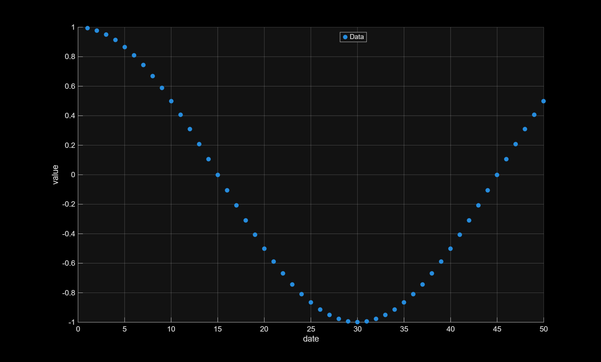
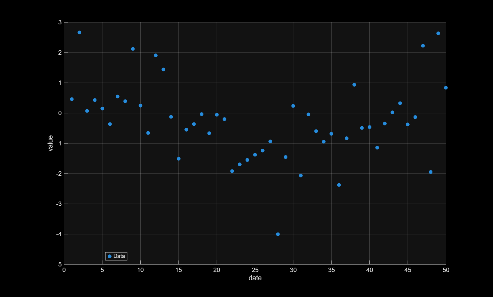
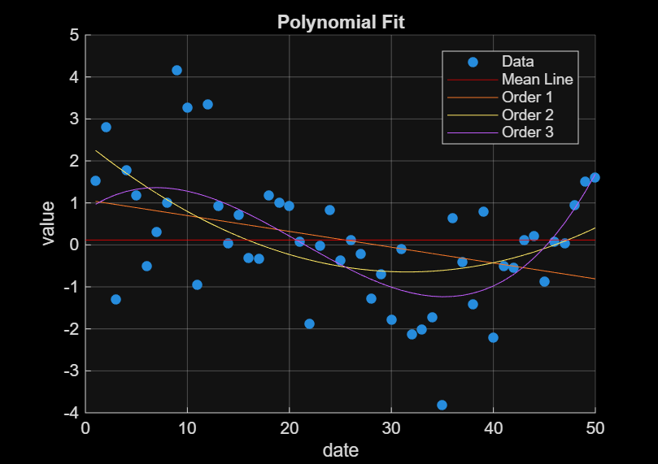
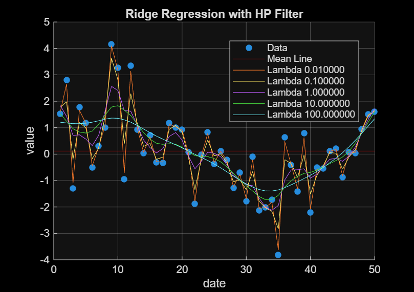

# Data Trending on Randomly Generated Data

This MATLAB project tests out some time-series fitting algorithms and plots the results. To reproduce the plots in `plots/`, run the following commands in MATLAB:

```bash
>> main("data/data.csv", "configs/config_hp_ridge.csv", "plots/hp_ridge_fit.png")
>> main("data/data2.csv", "configs/config_hp_ridge.csv", "plots/hp_ridge_fit2.png")
>> main("data/data2.csv", "configs/config_none.csv", "plots/no_fit.png")
>> main("data/data.csv", "configs/config_poly.csv", "plots/poly_fit.png")
>> main("data/data2.csv", "configs/config_poly.csv", "plots/poly_fit2.png")
>> main("data/data_no_noise.csv", "configs/config_poly.csv", "plots/poly_no_noise.png")
```

## Data Generation and Format
The cosNoiseData.m generates a 50 point sequence as daily values for a cosine function with a 60 day period and amplitude 1.
It additionally add random noise from a standard normal distribution. To run it, just specify an output file to save to:

```bash
>> cosNoiseData("data/example.csv")
```

The format consists of an index (1-50 days) and the corresponding noisy cosine values. With no noise, we have a basic cosine curve (cut off at 50 days, where the period of the curve is 60 days):




With noise added, the cosine curve is significantly obscured:



## Configs
|key|value|comment|
|---|---|---|
|mean_value_line|yes|none|
|data_trend_type_fit_line|hp_ridge|0.01_0.1_1_10_100|
|xlabel|date|none|
|ylabel|value|none|

Configs look like the above `configs/config_hp_ridge.csv`. There are three columns: key, value, and comment. The keys are preset, but the values can be edited. 

`mean_value_line` is a simple yes or no for the script to fit a horizontal line corresponding to the mean value of the data. 

`data_trend_type_fit` can take on 'poly' or 'hp_ridge' as its value. So far, this is also the only row with comments, which can be an underscore separated list of hyperparameters for the fitting algorithm (integers for 'poly', floats for 'hp_ridge'). The fitted line for each hyperparameter value will show up on the same plot for comparison.

`xlabel` and `ylabel` take string inputs in the 'value' column.

## Fitting Algorithms
This section will go over the two algorithms used to fit trend lines to the ground truth data.


### Polynomial Fit


This algorithm fits a polynomial of specified order (1-3 shown in the plot) to the ground truth points. In the plot above, the second order polynomial seems to best capture the curve of the cosine function over this domain, with the third order function slightly overfitting with an unnecessary inflection point around day 21. Intuitively, this makes sense since the cosine most resembles a parabola along this subset of its domain. 

### Hodrick-Prescott Filter Ridge Regression


This algorithm implements equation (1.1) on page one of the following paper:
https://www.jstage.jst.go.jp/article/jjss/45/2/45_121/_pdf

Note that this is a mean-squared error loss with a regularization term that penalizes elements of the inferred trend component that are sequentially far apart. The hyperparemeter lambda controls the severity of this penalty. For small lambda, the HP regression model tends to overfit, since it will seek to minimize MSE without any penalty. Larger values of lambda seem to smooth the HP regression line, since a higher priority is placed on "reigning in" the inferred trend points.